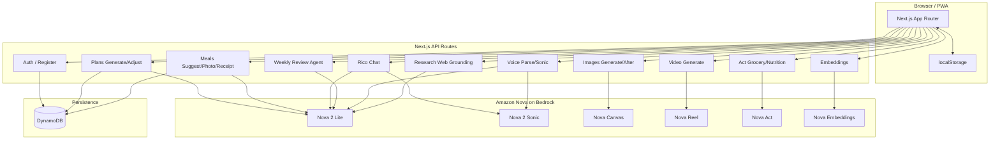
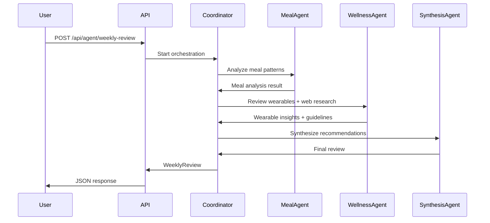

# Recomp Architecture

System design, data flow, and integration patterns for judges and contributors.

---

## High-Level Architecture

---

## Multi-Agent Weekly Review

The coordinator uses Nova 2 Lite tool use to delegate to specialist agents. Each agent performs tool calls (e.g., web grounding for research); the coordinator aggregates and routes. Typical flow: 3–5 rounds of tool orchestration before synthesis.

---

## Data Flow

| Layer | Components | Responsibility |
|-------|------------|-----------------|
| **Client** | `page.tsx`, Dashboard, MealsView, etc. | UI state, localStorage cache, view routing |
| **API** | Route handlers in `src/app/api/*` | Auth, rate limit, validation (Zod), Nova invocation |
| **Nova** | Bedrock Runtime | Lite, Sonic, Canvas, Reel, embeddings, Act |
| **Storage** | DynamoDB, localStorage | Profile, meals, plan, milestones, wearables |

Local-first: `localStorage` is the primary cache; `syncToServer` pushes to DynamoDB when authenticated. Works offline with demo mode.

---

## Nova Integration Summary

| Nova Feature | Route(s) | Purpose |
|--------------|----------|---------|
| Nova 2 Lite | plans/generate, meals/suggest, rico, agent/weekly-review, voice/parse, meals/analyze-*, research | Text generation, image understanding, tool use |
| Nova 2 Sonic | voice/sonic, voice/sonic/stream | Bidirectional streaming voice (Reco + meal logging) |
| Nova Canvas | images/generate, images/after | Meal inspiration; transformation preview |
| Nova Reel | video/generate | Exercise form demo clips |
| Nova Act | act/grocery, act/nutrition | Grocery search; USDA nutrition lookup |
| Nova Embeddings | embeddings | Text similarity for meal recommendations |
| Web Grounding | research | Nutrition/fitness guidelines |
| Extended Thinking | plans/generate | High reasoning for plan quality |

---

## Security & Resilience

- **Rate limiting**: Fixed-window per route (e.g., 20 req/min for plans/generate)
- **Auth**: HttpOnly cookie (`recomp_uid`); server validates on protected routes
- **Validation**: Zod schemas on registration, plan generation, voice input
- **Error boundaries**: React error boundaries; graceful fallbacks for Nova/Act failures
- **Demo mode**: Act and auth fallbacks so app remains usable without full config

---

*This document supports hackathon judging criteria: Technical Implementation.*
