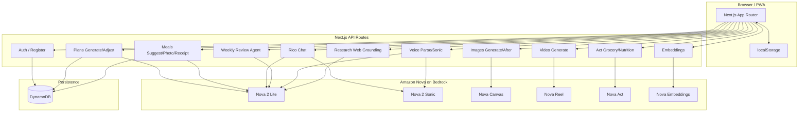
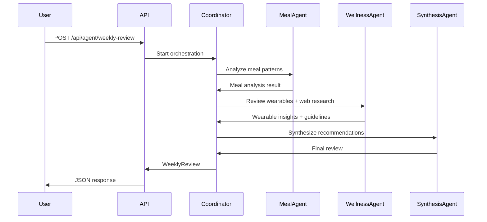

# Recomp Architecture

System design, data flow, and integration patterns for judges and contributors.

---

## High-Level Architecture

```mermaid
flowchart TB
    subgraph Client["Browser / PWA"]
        UI[Next.js App Router]
        LS[localStorage]
    end

    subgraph API["Next.js API Routes"]
        Auth[Auth / Register]
        Plans[Plans Generate/Adjust]
        Meals[Meals Suggest/Photo/Receipt]
        Rico[Rico Chat]
        Agent[Weekly Review Agent]
        Act[Act Grocery/Nutrition]
        Voice[Voice Parse/Sonic]
        Img[Images Generate/After]
        Vid[Video Generate]
        Emb[Embeddings]
        Research[Research Web Grounding]
    end

    subgraph Nova["Amazon Nova on Bedrock"]
        Lite[Nova 2 Lite]
        Sonic[Nova 2 Sonic]
        Canvas[Nova Canvas]
        Reel[Nova Reel]
        ActSDK[Nova Act]
        Embed[Nova Embeddings]
    end

    subgraph Storage["Persistence"]
        DDB[(DynamoDB)]
    end

    UI --> Auth
    UI --> Plans
    UI --> Meals
    UI --> Rico
    UI --> Agent
    UI --> Act
    UI --> Voice
    UI --> Img
    UI --> Vid
    UI --> Emb
    UI --> Research
    UI <--> LS

    Plans --> Lite
    Meals --> Lite
    Rico --> Lite
    Rico --> Sonic
    Agent --> Lite
    Voice --> Lite
    Voice --> Sonic
    Img --> Canvas
    Vid --> Reel
    Act --> ActSDK
    Emb --> Embed
    Research --> Lite

    Auth --> DDB
    Plans --> DDB
    Meals --> DDB
```

---

## Multi-Agent Weekly Review

```mermaid
sequenceDiagram
    participant User
    participant API
    participant Coordinator
    participant MealAgent
    participant WellnessAgent
    participant SynthesisAgent

    User->>API: POST /api/agent/weekly-review
    API->>Coordinator: Start orchestration
    Coordinator->>MealAgent: Analyze meal patterns
    MealAgent->>Coordinator: Meal analysis result
    Coordinator->>WellnessAgent: Review wearables + web research
    WellnessAgent->>Coordinator: Wearable insights + guidelines
    Coordinator->>SynthesisAgent: Synthesize recommendations
    SynthesisAgent->>Coordinator: Final review
    Coordinator->>API: WeeklyReview
    API->>User: JSON response
```

The coordinator uses Nova 2 Lite tool use to delegate to specialist agents. Each agent performs tool calls (e.g., web grounding for research); the coordinator aggregates and routes. Typical flow: 3–5 rounds of tool orchestration before synthesis.

---

## API Layer Separation

Routes delegate business logic to services in `src/lib/services/`. See [docs/API_STRUCTURE.md](./docs/API_STRUCTURE.md) for the full domain map and migration status.

| Service | Routes | Responsibility |
|---------|--------|-----------------|
| `services/meals.ts` | meals/suggest | Curated recipes, Nova-based meal suggestions |
| `services/body-scan.ts` | body-scan/progress-reel | Progress reel start, poll, demo video |

---

## Data Flow

| Layer | Components | Responsibility |
|-------|------------|-----------------|
| **Client** | `page.tsx`, Dashboard, MealsView, etc. | UI state, localStorage cache, view routing |
| **API** | Route handlers in `src/app/api/*` | Auth, rate limit, validation (Zod), Nova invocation |
| **Nova** | Bedrock Runtime | Lite, Sonic, Canvas, Reel, embeddings, Act |
| **Storage** | DynamoDB, localStorage | Profile, meals, plan, milestones, wearables |

Local-first: `localStorage` is the primary cache; `syncToServer` pushes to DynamoDB when authenticated. Works offline with demo mode.

---

## Nova Integration Summary

| Nova Feature | Route(s) | Purpose |
|--------------|----------|---------|
| Nova 2 Lite | plans/generate, meals/suggest, rico, agent/weekly-review, voice/parse, meals/analyze-*, research | Text generation, image understanding, tool use |
| Nova 2 Sonic | voice/sonic, voice/sonic/stream | Bidirectional streaming voice (Reco + meal logging) |
| Nova Canvas | images/generate, images/after | Meal inspiration; transformation preview |
| Nova Reel | video/generate, body-scan/progress-reel | Exercise clips; body scan transformation video |
| Nova Act | act/grocery, act/nutrition | Grocery search; USDA nutrition lookup |
| Nova Embeddings | embeddings | Text similarity for meal recommendations |
| Web Grounding | research | Nutrition/fitness guidelines |
| Extended Thinking | plans/generate | High reasoning for plan quality |

---

## DynamoDB Schema (single-table)

**Table:** `DYNAMODB_TABLE_NAME` (default: `RecompTable`). No sort key required for simple Get; use `begins_with(SK, :prefix)` for queries.

### User-scoped entities

| PK | SK | Data |
|----|-----|------|
| `USER#{userId}` | `PROFILE` | User profile |
| `USER#{userId}` | `PLAN` | Fitness plan |
| `USER#{userId}` | `META` | xp, ricoHistory, activityLog, workoutProgress, etc. |
| `USER#{userId}` | `MEAL#{date}#{id}` | Meal entry |
| `USER#{userId}` | `MILESTONE#{id}` | Milestone |
| `USER#{userId}` | `WCONN#{provider}` | Wearable connection |
| `USER#{userId}` | `WDATA#{date}#{provider}` | Wearable day summary |
| `USER#{userId}` | `WEEKLY_REVIEW` | Weekly AI review |
| `USER#{userId}` | `SOCIAL` | Social settings (visibility, username) |
| `USER#{userId}` | `GROUP#{groupId}` | Group membership |
| `USER#{userId}` | `PUSH#...` / `EXPO#...` | Push subscription tokens |

### Groups & social

| PK | SK | Data |
|----|-----|------|
| `GROUP#{groupId}` | `META` | Group metadata |
| `GROUP#{groupId}` | `MEMBER#{userId}` | Group membership |
| `GROUP#{groupId}` | `MSG#{ts}#{id}` | Group message |
| `GROUP#{groupId}` | `PROGRESS#{userId}` | Member progress |
| `GROUPS_INDEX#{goalType}` | `GROUP#{groupId}` | Discoverable groups by goal |
| `INVITE#{code}` | `INVITE#{code}` | Invite code → groupId |
| `USERNAME#{key}` | `USERNAME#{key}` | Username → userId |

### Other

| PK | SK | Data |
|----|-----|------|
| `CALENDAR#{token}` | `CALENDAR#{token}` | ICS feed config |
| `NUTRITION#{foodKey}` | `CACHE` | USDA nutrition cache |
| `FEEDBACK` | `FEEDBACK#{ts}#{uuid}` | User feedback entries |

**Migrations:** Schema is implicit; no migration runner. Add new PK/SK patterns in `db.ts` as needed.

**Billing:** Pay per request.

---

## Nova Act Integration (UI Automation)

Recomp uses **Nova Act SDK** for grocery search and nutrition lookup. Act runs browser automation (Chromium) and cannot execute inside Vercel serverless. Two deployment paths:

### Production (recommended): Act microservice

- **Location:** `act-service/` (Python + Nova Act SDK) deployed to Railway/Render
- **SDK usage:** The Act service invokes `nova-act` Python package to automate Amazon Fresh/Whole Foods/Amazon product search. It opens a headless browser, navigates to the store, searches for each ingredient, and returns product links + add-to-cart URLs.
- **Next.js → Act:** API routes (`/api/act/grocery`, `/api/act/nutrition`) call `ACT_SERVICE_URL` via HTTP POST. The service runs Nova Act tasks and returns structured JSON.
- **Env:** Set `ACT_SERVICE_URL` (e.g. `https://recomp-production.up.railway.app`) in Vercel; optional `NOVA_ACT_API_KEY` if the service requires it.

### Local development

- **Fallback:** If `ACT_SERVICE_URL` is unset, Next.js invokes `scripts/nova_act_grocery.py` via `runPython()` when Python + `nova-act` are installed.
- **Direct SDK:** The Python script imports `nova_act` and uses it to perform the same grocery/nutrition automation locally.

### Judge mode

- `JUDGE_MODE=true` returns deterministic fallback data (demo product results) without calling Act. Verify at `/api/judge/health`.

---

## ExerciseDB (GIF demos)

- **Search:** `exercisedb.dev/api/v1/exercises?search=...`
- **GIF CDN:** `static.exercisedb.dev/media/{id}.gif` (can have SSL/404 issues)
- **Proxy:** `/api/exercises/gif?id=...` fetches server-side to avoid browser TLS issues
- **Fallback:** exercises-gifs on GitHub when CDN fails; "Demo unavailable" SVG if both fail

---

## Security & Resilience

- **Rate limiting**: Fixed-window per route (e.g., 20 req/min for plans/generate)
- **Auth**: HttpOnly cookie (`recomp_uid`); server validates on protected routes
- **Validation**: Zod schemas on registration, plan generation, voice input
- **Error boundaries**: React error boundaries; graceful fallbacks for Nova/Act failures
- **Demo mode**: Act and auth fallbacks so app remains usable without full config
